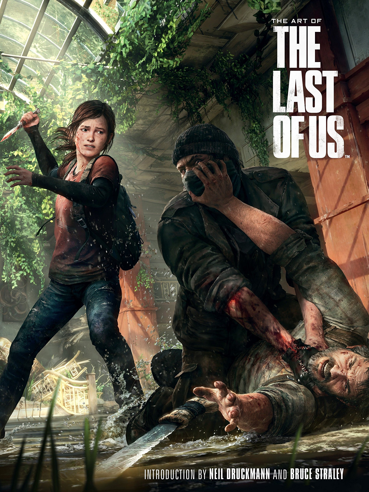
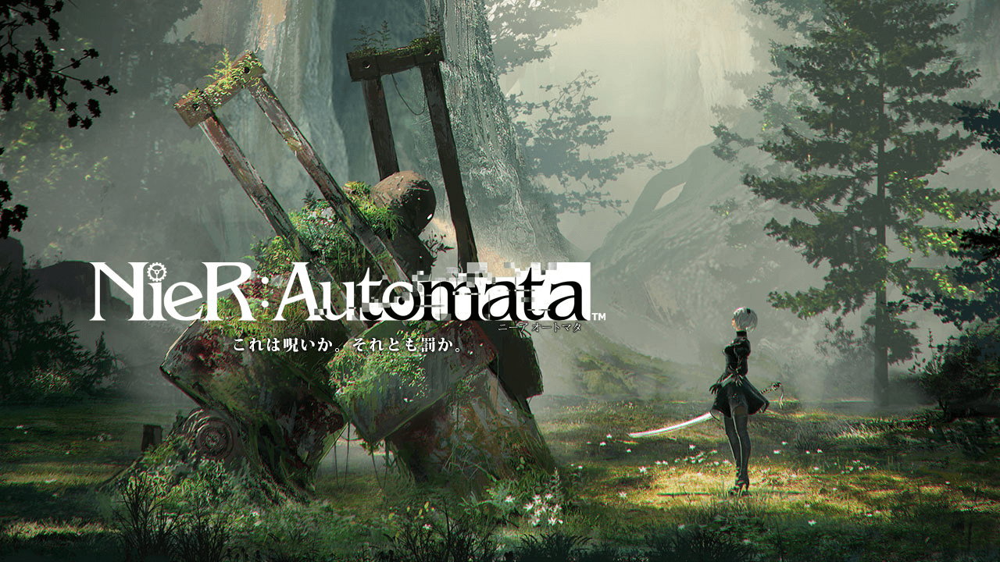

<!DOCTYPE html>
 <html lang="es">
  <head>
       <title>Victor Curiel Galindo</title>
       <link rel="stylesheet" href="estilosini.css">
	   <meta charset="utf-8">
  </head>
  <body>
   <header id="titulo">Videojuegos más famosos 20010-2022</header>
   <nav class="navegacion">
    <a href="#juego1">1º</a>
    <a href="#juego2">2º</a>
    <a href="#juego3">3º</a>
    <a href="#juego4">4º</a>
    <a href="#juego5">5º</a>
    <a href="#juego6">6º</a>
    <a href="#juego8">8º</a>
    <a href="#juego9">9º</a>
    <a href="#juego10">10º</a>
   </nav>
   <main>
    <section class="juego" id="juego1">
      <h1>1º:The legend of Zelda: Breath of the Wild</h1>
	  
The Legend of Zelda: Breath of the Wild es un videojuego exclusivo de Nintendo, desarrollado, producido y distribuido por la misma compañía, para las videoconsolas Wii U y Nintendo Switch. A diferencia de otras entregas de la saga, Breath of the Wild es un videojuego de mundo abierto proporcionando novedad a la saga.

	  <a href="https://zelda.fandom.com/es/wiki/The_Legend_of_Zelda:_Breath_of_the_Wild" target="_blank">Aprende mas de The Legend of Zelda: Breath of the Wild</a>
	  
	  <iframe class="video" width="700" height="466" src="https://www.youtube.com/embed/ofH5ptn5w-A" title="YouTube video player" allow="accelerometer; autoplay; clipboard-write; encrypted-media; gyroscope; picture-in-picture" allowfullscreen></iframe>
    </section>
    <section class="juego" id="juego2">
	 <h1>2º:Super Mario Odyssey</h1>
	 
Super Mario Odyssey es un videojuego de plataformas de mundo abierto para Nintendo Switch. Es el decimosexto título de la serie Super Mario y el séptimo videojuego de plataformas 3D de la misma. En este videojuego Nintendo sorprende con una jugabilidad original que ha llevado a Super Mario Odyssey a ser uno de los mejores videojuegos del genero plataformas.

	 <a href="https://mario.fandom.com/es/wiki/Super_Mario_Odyssey" target="_blank">Aprende mas de Mario Odyssey</a>
	 
	 <iframe class="video" width="495" height="500" src="https://www.youtube.com/embed/EF5YynyWvQo" title="YouTube video player" allow="accelerometer; autoplay; clipboard-write; encrypted-media; gyroscope; picture-in-picture" allowfullscreen></iframe>
    </section>
	<section class="juego" id="juego3">
	 <h1>3º:The last of Us</h1>
	 
The Last of Us es un videojuego de genero Drama, Survival Horror y Acción-Aventura en tercera persona desarrollado por Naughty Dog y publicado por Sony Interactive Entertainment. Con una historia muy cruda y una jugabilidad de lo más tensa, The last of Us es uno de los mejores survival-horror que hay hoy en día.

	 <a href="https://thelastofus.fandom.com/es/wiki/The_Last_of_Us" target="_blank">Aprende mas de The last of Us</a>
	 
	 <iframe class="video" width="560" height="426" src="https://www.youtube.com/embed/QGZM9bAB1_4" title="YouTube video player" allow="accelerometer; autoplay; clipboard-write; encrypted-media; gyroscope; picture-in-picture" allowfullscreen></iframe>
	</section>
	<section class="juego" id="juego4">
	 <h1>4º:NieR: Automata</h1>
	 
NieR: Automata es un videojuego de rol de acción desarrollado por PlatinumGames y publicado por Square Enix para múltiples plataformas. Este videojuego nos presenta una historia original con una jugabilidad muy diversa, NieR es un jrpg que proporciona muchas horas de entretenimiento.

	 <a href="https://nier.fandom.com/wiki/NieR:Automata" target="_blank">Aprende mas de NieR: Automata</a>
	 
	 <iframe class="video" width="640" height="360" src="https://www.youtube.com/embed/qvemKwb20vY" title="YouTube video player" allow="accelerometer; autoplay; clipboard-write; encrypted-media; gyroscope; picture-in-picture" allowfullscreen></iframe>
	</section>
	<section class="juego" id="juego5">
	 <h1>5º:Red Dead Redemption</h1>
	 
Red Dead Redemption es un videojuego de acción y aventura estilo sandbox ambientado en el Viejo Oeste que ha sido desarrollado por Rockstar San Diego y distribuido Rockstar Games. Si te gusta el género salvaje oeste, Red Dead Redemption es el juego idóneo para ti.

	 <a href="https://reddead.fandom.com/es/wiki/Red_Dead_Redemption" target="_blank">Aprende mas de Red Dead Redemption</a>
	 
	 <iframe class="video" width="560" height="315" src="https://www.youtube.com/embed/-8MN89fIaJ8" title="YouTube video player" allow="accelerometer; autoplay; clipboard-write; encrypted-media; gyroscope; picture-in-picture" allowfullscreen></iframe>
	</section>
	<section class="juego" id="juego6">
	 <h1>6º:God of War (2018)</h1>
	 
God of War es un videojuego de acción-aventura desarrollado por SCE Santa Monica Studio y publicado por Sony Interactive Entertainment. A todos nos sorprendió ver este videojuego cuando lo anunciaron, God of War es una novedad en todos los ámbitos si lo comparamos con anteriores entregas de la saga, esta vez God of War se centra en la mitología nórdica por lo que Kratos se enfrentará a todo tipo de criaturas mitológicas y dioses nordicos.

	 <a href="https://godofwar.fandom.com/es/wiki/God_of_War_(2018)" target="_blank">Aprende mas de God of War</a>
	 
	 <iframe class="video" width="560" height="315" src="https://www.youtube.com/embed/dK42JGgkoF8" title="YouTube video player" allow="accelerometer; autoplay; clipboard-write; encrypted-media; gyroscope; picture-in-picture" allowfullscreen></iframe>
	</section>
	<section class="juego" id="juego7">
	 <h1>7º:Super Mario Galaxy 2</h1>
	 
Super Mario Galaxy 2 es el primer juego de aventuras de la saga principal de Mario para la Nintendo Wii, y por primera vez Mario desarrolla su historia en el universo. Super Mario Galaxy 2 fue y sigue siendo unos de los mejores videojuegos en su categoría asique no es sorpresa de nadie que se encuentre en este top. Esta sería la segunda visita de Mario al espacio, ya que en esta entrega decide ayudar a un nuevo personaje, Estella, la cual esta preocupada ya que Bowser a vuelto a hacer de las suyas.

	 <a href="https://mario.fandom.com/es/wiki/Super_Mario_Galaxy_2" target="_blank">Aprende mas de Super Mario Galaxy 2</a>
	 
	 <iframe class="video" width="560" height="315" src="https://www.youtube.com/embed/9yTZcpAx1ik" title="YouTube video player" allow="accelerometer; autoplay; clipboard-write; encrypted-media; gyroscope; picture-in-picture" allowfullscreen></iframe>
	</section>
	<section class="juego" id="juego8">
	 <h1>8º:Uncharted 4</h1>
	 
Uncharted 4 es un videojuego de acción-aventura en tercera persona distribuido por Sony Computer Entertainment y desarrollado por Naughty Dog. Este es el cuarto juego de la saga Uncharted por parte de Naughty Dog es un juego fantástico para fans de la saga y para novatos de la misma.

	 <a href="https://uncharted.fandom.com/es/wiki/Uncharted_4:_El_desenlace_del_ladr%C3%B3n" target="_blank">Aprende mas de Uncharted 4</a>
	 
	 <iframe class="video" width="512" height="288" src="https://www.youtube.com/embed/34GJ9ZMAKqA" title="YouTube video player" allow="accelerometer; autoplay; clipboard-write; encrypted-media; gyroscope; picture-in-picture" allowfullscreen></iframe>
	</section>
	<section class="juego" id="juego9">
	 <h1>9º:Bayonetta</h1>
	 
Bayonetta es un videojuego de acción del genero "hack and slash" desarrollado por PlatinumGames y publicado por Sega para multiples plataformas. Bayonetta es un videojuego con una jugabilidad parecida a los God of War clásicos y a los Devil May Cry pero con un estilo totalmente orignal. Bayonetta es una de las últimas brujas que hay en el mundo y tiene que defenderse tanto de demonios como de ángeles y lo hará con todo tipo de coreografías y poderes y sobretodo con estilo, con muuucho estilo.

	 <a href="https://bayonetta.fandom.com/es/wiki/Bayonetta" target="_blank">Aprende mas de Bayonetta</a>
	 
	 <iframe class="video" width="560" height="315" src="https://www.youtube.com/embed/HiD5TX3AZfE" title="YouTube video player" allow="accelerometer; autoplay; clipboard-write; encrypted-media; gyroscope; picture-in-picture" allowfullscreen></iframe>
	</section>
	<section class="juego" id="juego10">
	 <h1>10º:Celeste</h1>
	 
Celeste es un videojuego de plataformas en scroll lateral e indie desarrollado por Extremely OK Games, publicado en multiples plataformas. Celeste , en mi opinión es uno de los mejores plataformas de la historia, y esque este videojuego no tiene prácticamente ningun error, el estilo artístico, la jugabilidad, la banda sonora, la historia y el guión, todo es destacable y merece la pena jugarlo.

	 <a href="https://celestegame.fandom.com/wiki/Celeste" target="_blank">Aprende mas de Celeste</a>
	 
	 <iframe class="video" width="638" height="384" src="https://www.youtube.com/embed/70d9irlxiB4" title="YouTube video player"  allow="accelerometer; autoplay; clipboard-write; encrypted-media; gyroscope; picture-in-picture" allowfullscreen></iframe>
	</section>
    <a href="#juego1" class="navegacion">Inicio</a>
   </main>
   <aside></aside>
   <footer></footer>
  </body>
</html>
